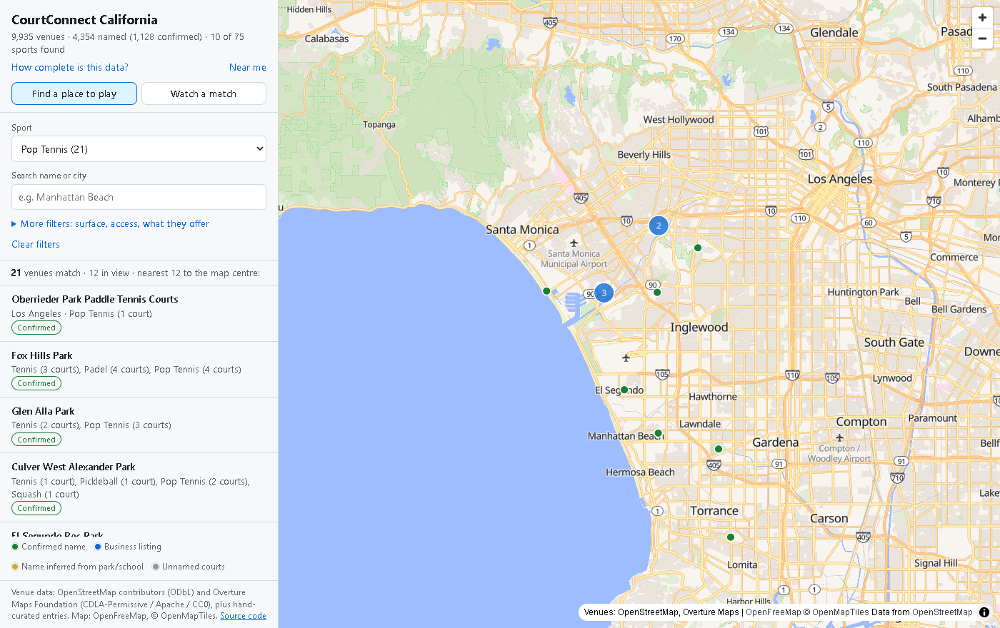
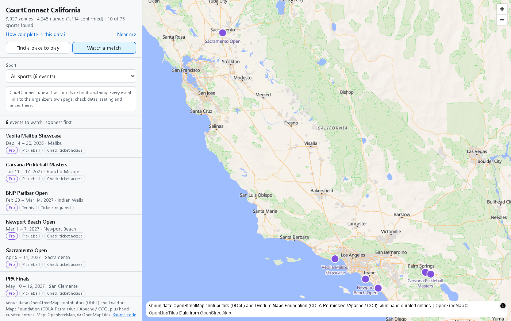
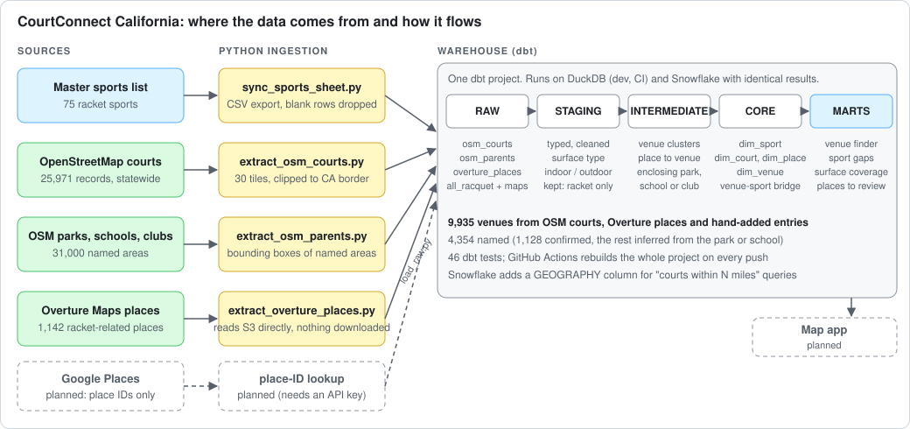

# CourtConnect California

**Find where to play, who to play with, and where to watch, for every racket sport in California.**

**[Open the live map](https://abov.github.io/courtconnect-ca/)**: 9,935 venues across California, with an honest panel showing which of the 75 sports have no data yet, and a **Watch a match** mode for events you can go and see.

| Find a place to play | Watch a match |
|---|---|
|  |  |

*CourtConnect is a discovery tool: it helps you find where to play or watch, then sends you to the venue's or organizer's own site. It doesn't sell tickets or take bookings.*

> Plain-English summary: Pickleball, padel, tennis, squash, and 40+ lesser-known racket sports
> are booming, but information about *where to play* is scattered and messy. This project collects
> it, cleans it, checks it, and tells you honestly how complete it is.

## What works today (Phase 1)
- A cleaned reference list of **75 racket sports** (from a hand-maintained master list, full of typos and mixed units, now typed and validated). The sheet is meant to list 76; a warning test flags the gap until it does.
- **All of California from two open sources: 25,971 OpenStreetMap court records plus Overture Maps places, grouped into 9,925 venues** by proximity (a 28-court club is one row, not 28), for tennis, pickleball, padel, table tennis, badminton, squash and more
- **Venue names:** 4,343 of 9,925 venues have a name; 1,112 are confirmed (tagged on the court, or from a business listing) and the rest are inferred from the park, school or club the court sits inside, labelled as such. Overture places added 435 venues OpenStreetMap had no court for (clubs, indoor facilities) plus websites and phone numbers
- **Courts by surface and indoor/outdoor** (`mart_sport_surface_coverage`), and an honest **gaps report** for all 75 sports (`mart_sport_gaps`, snapshot in [`docs/coverage_snapshot.md`](docs/coverage_snapshot.md)): 9 sports well covered, 1 sparse (Beach Tennis, 2 confirmed venues), 12 tagged in OpenStreetMap but empty in California, 53 with nothing found in either source
- **46 automated tests** across 21 models (all passing, plus one deliberate warning on the sport count) that catch bad data before anyone sees it
- The same project runs on **local DuckDB and Snowflake** with identical results, including a geospatial search ("padel within 12 miles of downtown")

## How it fits together


## 60-second demo
```bash
pip install -r requirements.txt
make demo      # extract -> load -> build -> test
```
Then open `courtconnect.duckdb` and query `marts.mart_sport_coverage`.

**The story to tell:** *"Here's the messy spreadsheet; here's the clean table. Here's California: 26,000 anonymous map points plus a business directory became about 9,900 places, and the share with a name went from 2% to 44%. But 53 of the 75 sports can't be found in either source, so I built the gaps report to show exactly where the data is thin instead of hiding it. And I chose the open Overture dataset over Google Places because Google's terms don't allow storing its data."*

## The sports list: `all_racquet`
The sheet tab **All Raquet** is the source of truth for which sports the platform supports. It is loaded as the
`raw.all_racquet` table (a dbt seed), then cleaned into `dim_sport`.

```bash
make sync-sports   # re-pull the sheet -> transform/seeds/all_racquet.csv (needs SPORTS_SHEET_ID in .env)
make build         # reload and re-test
```
**Editing the list.** The Google Sheet is the single place to edit (rename a sport, fix a typo, add a new one). The sheet's owner
account can edit it; "anyone with the link" is view-only, which is what lets the sync read it without a login. To let a second
account edit, the owner shares the sheet with it as *Editor*. Never edit `transform/seeds/all_racquet.csv` or the
Snowflake `RAW.ALL_RACQUET` table by hand: the next sync overwrites both.

Alternate names for a sport (e.g. "Frescobol" for Frescoball) go in [`transform/seeds/sport_aliases.csv`](transform/seeds/sport_aliases.csv).
Sports that OpenStreetMap cannot find, and why, are listed in [`docs/sport_name_review.md`](docs/sport_name_review.md). Data licenses and attribution: [`NOTICE.md`](NOTICE.md).

## Dead websites
Listings go stale: about 10% of the websites in the open places data point at domains that no longer exist, and even its
highest-confidence listings are dead about 1 time in 12 (8.5%; OpenStreetMap: 0 of 64). `make check-websites` runs a DNS-only check
(no pages fetched), flags each venue's `website_status` (`ok`, `dead`, `unknown`) and the app-facing `website_usable` column hides
dead links. A site only counts as dead on a definitive "domain does not exist" answer, so a flaky network can't mislabel a good one.
See `marts.mart_website_quality`.

## The map app
A static, no-server page in [`app/`](app): filter by sport, surface (sand, clay, grass, hard), indoor/outdoor, public/free/lights,
what a club offers (lessons, open play, tournaments), or search by name or city. Pins are coloured by how much to trust the name
(confirmed, business listing, inferred from the park, unnamed) and the **How complete is this data?** panel lists all 75 sports with
their status. Filters live in the URL, so any view is shareable. It reads one 1.3 MB file and phone numbers are never exported.

```bash
make app-data   # export from the warehouse
make app        # open http://localhost:8765
```

## Watch a match
**Watch a match** mode lists events you can go and see, soonest first, with the organizer's link. Today: the BNP Paribas Open (tennis, Indian Wells)
and five PPA Tour pickleball stops (Malibu, Rancho Mirage, Newport Beach, Sacramento, San Clemente). Every entry carries its source and a
`verified_on` date, and past events hide themselves. Add one by adding a row to
[`transform/seeds/watch_events.csv`](transform/seeds/watch_events.csv) (tests reject bad coordinates, backwards dates and non-https links), then
`make build && make app-data`. Why events are link-outs, and what I found about Playtomic, PlayByPoint and others: [ADR 0006](docs/decisions/0006-watch-events-and-link-out-discovery.md).

## Paddle tennis courts and "ways to join"
- **Paddle tennis (Pop Tennis) courts:** 15 public or "in question" courts from a hand-compiled West LA map are in the data, taking Pop Tennis from 7 to
  **21 venues and 54 courts**. Private entries (clubs, apartment complexes and private homes) were left out on purpose. Where a court
  sits within 150 m of a venue we already hold, it is **merged into that venue** instead of adding a second pin. Entries the map marks "?" show
  **Public access not confirmed**, and the map's own court rules are shown verbatim. The map's ID lives in `.env` (`PADDLE_TENNIS_MAP_ID`),
  and `ingestion/import_paddle_tennis_map.py` refreshes the rows; review its output before committing.
- **Ways to join (link-outs):** [`transform/seeds/venue_actions.csv`](transform/seeds/venue_actions.csv) lists what you can do at a venue
  (`open_play`, `clinic`, `private_lesson`, `group_class`, `drop_in`, `tournament`, `league`, `social_event`, `court_booking`, `club_page`),
  each with the provider's own link, price note, dates and an `evidence` note. Today these point to [BracketSync](https://bracketsync.com):
  Beach Tennis Cali Club's current league and club page, Beach Tennis Santa Monica, and Pop Paddle Venice. CourtConnect takes no
  registrations or payments; the provider does. Details and what I found about BracketSync's terms: [ADR 0006](docs/decisions/0006-watch-events-and-link-out-discovery.md).

## Reviewing uncertain matches
Some business names look like a sport but may not be ("Camino Real Tennis Center" is not Real Tennis). Those are kept out of the
totals and listed in `marts.mart_places_to_review`. To confirm or reject one, add a row to
[`transform/seeds/place_sport_overrides.csv`](transform/seeds/place_sport_overrides.csv) (`place_id,sport,confirm` or `reject`) and run `make build`.

## Adding a venue the data doesn't know about
Local clubs that no dataset lists (beach tennis clubs, community groups) go in
[`transform/seeds/manual_venues.csv`](transform/seeds/manual_venues.csv): one row per venue and sport, with coordinates, surface
(`sand`, `clay`, ...), setting (`indoor` / `outdoor`), what it offers (`open_play`, `clinics`, `private_lessons`, `group_classes`,
`drop_in`, `tournaments`) and an `evidence` note saying how well the entry is backed up. Then `make build`. These venues show up as
`venue_source = 'manual'`, so they are never mistaken for verified data, and a test fails the build if a coordinate is mistyped.

## For engineers
- dbt project runs unchanged on **DuckDB (dev/CI)** and **Snowflake** via `adapter.dispatch` macros
- Idempotent loads, dbt tests (unique, not-null, accepted values, relationships, custom geo-bounds test)
- Source freshness check, Snowflake resource monitor + least-privilege role (`infra/snowflake/00_setup.sql`)
- Architecture decisions in [`docs/decisions`](docs/decisions); layout in [`docs/architecture.md`](docs/architecture.md)

## Run on Snowflake
1. Run `infra/snowflake/00_setup.sql` in Snowsight as ACCOUNTADMIN
2. `cp .env.example .env` and add your credentials
3. `make snowflake-build`

## Roadmap
- [x] `dim_venue`: cluster individual courts into facilities ([ADR 0003](docs/decisions/0003-venue-clustering-by-proximity.md))
- [x] Statewide extract and venue naming from enclosing parks / schools / clubs ([ADR 0004](docs/decisions/0004-statewide-extract-and-venue-naming.md))
- [x] Second source: Overture Maps places, with graded evidence and a human review file ([ADR 0005](docs/decisions/0005-overture-places-and-google-terms.md))
- [x] Watch a match: curated events with organizer link-outs ([ADR 0006](docs/decisions/0006-watch-events-and-link-out-discovery.md))
- [ ] Link-outs for booking, clinics, private lessons, open play and social events (needs provider partnerships or permitted feeds; Playtomic Connect, PlayByPoint)
- [ ] Google place IDs for live lookup (built, dry-run only; needs an API key)
- [ ] Governing-body and club directories for the 53 sports neither source finds
- [ ] S3 landing zone, Snowpipe, Terraform
- [ ] Events and ticketing (pro/amateur matches, watch parties)
- [ ] Synthetic social layer (groups, sessions) with PII masking policies
- [ ] Map app / Streamlit front end
